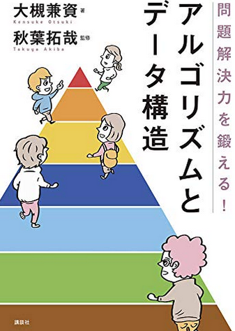

<div align="center">
<h1>
    <br>
    「問題解決力を鍛える！アルゴリズムとデータ構造」Python ver
    <br>
</h1>
</div>

## 概要
本に記載されているC++のコードを、Pythonで実装したものです。
1. アルゴリズムとは
1. 計算量とオーダー記法
1. 設計技法(1) : 全探索
1. 設計技法(2) : 才気と分割統治法
1. 設計技法(3) : 動的計画法
1. 設計技法(4) : 二分木探索
1. 設計技法(5) : 貪欲法
1. データ構造(1) : 配列, 連結リスト, ハッシュテーブル
1. データ構造(2) : スタックとキュー
1. データ構造(3) :　グラフと木
1. データ構造(4) :　Union-Find　
1. ソート
1. グラフ(1) : グラフ探索
1. グラフ(2) : 最短路問題
1. グラフ(3) : 最小全域木問題
1. グラフ(4) : ネットワークフロー
1. PとNP
1. 難問対策

## 動作確認用
```bash
10 7
3 5 8 9 7 10 22 1 2 100
```

## 公式資料
[「問題解決力を鍛える！アルゴリズムとデータ構造」の公式コード(C++)](https://github.com/drken1215/book_algorithm_solution/tree/bf4af1b13b6fb1f58b8a921ab319096422f064d6)

